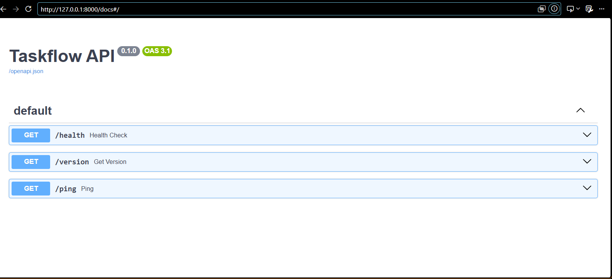

# Practica 1

## Instalación 

1. Activa el entorno virtual.
2. Instala las dependencias:
```bash
   pip install -r requirements.txt
   ```

## Arranque
Para levantar el servidor: 
```bash
uvicorn app.main:app --reload
```

## Endpoints Disponibles
1. GET /health: Verifica el estado de la API ({"status": "ok"}).

2. GET /version: Devuelve la versión actual.

3. GET /ping: Respuesta rápida de conexión.

## Documentacion

La interfaz Swagger UI se genera automáticamente y está accesible en http://127.0.0.1:8000/docs una vez arrancado el servidor

## Captura de pantalla 
